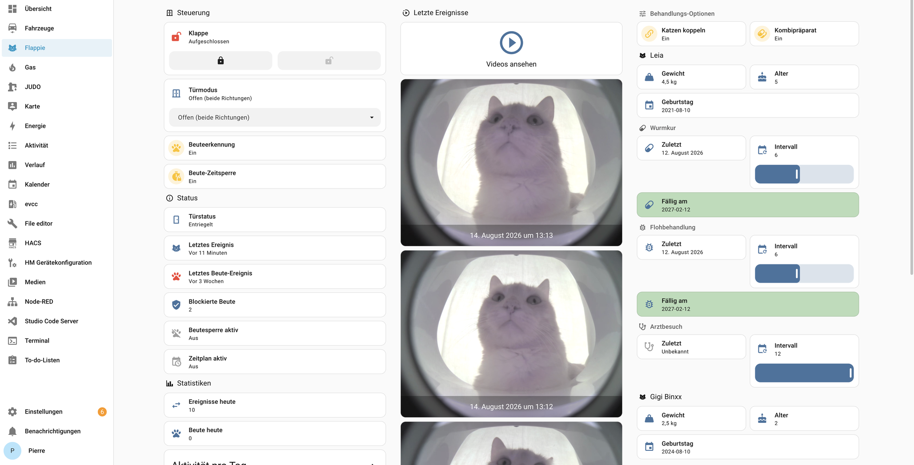
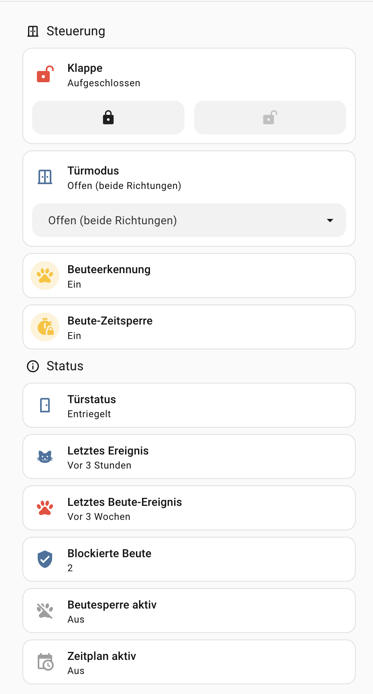
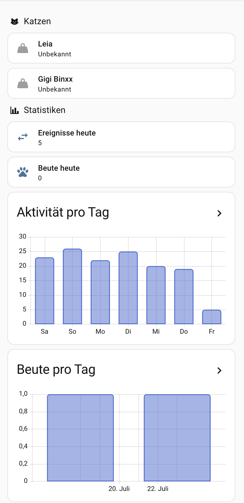
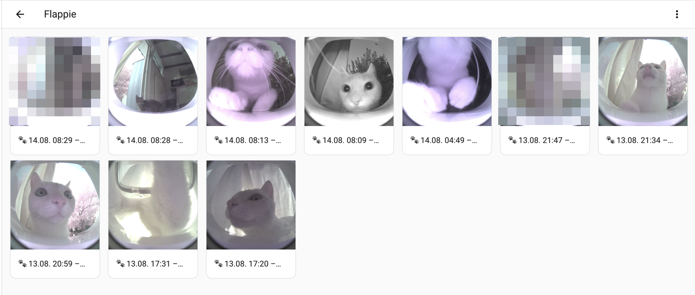
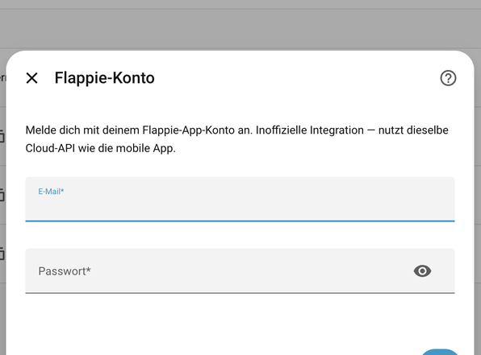

# Flappie for Home Assistant

[](https://github.com/hacs/integration)
[](https://github.com/medicusdkfz/ha-flappie/releases)
[](LICENSE)
[](https://github.com/medicusdkfz/ha-flappie/actions/workflows/validate.yml)

🇩🇪 [Deutsche Version dieser Dokumentation](README.de.md)

Unofficial Home Assistant integration for the [Flappie](https://flappiedoors.com) smart cat door with AI prey detection. Control the door, watch event photos and videos, get prey alerts, and chart long-term activity — all from Home Assistant.

> **Disclaimer:** This project is not affiliated with Flappie Technologies AG. It talks to the same undocumented cloud API as the official mobile app (`app.flappiedoors.com`). The vendor may change the API at any time. There is **no local API** — the door communicates exclusively with the cloud, and so does this integration.

The API layer is a Python port of the reverse-engineered npm package [`flappie-api`](https://github.com/ooswald/flappie-api) by Olivier Oswald — see its [`CLOUD_API.md`](https://github.com/ooswald/flappie-api/blob/main/CLOUD_API.md) for the raw endpoint reference.

---

## Features

- **Config-flow setup** — sign in with your Flappie app account from the UI, automatic token refresh, re-auth flow on password change
- **Door control** — lock entity plus a door-mode select covering all four policies (open both ways, closed, entry-only, exit-only)
- **Settings switches** — AI prey detection, prey timed lock (incl. duration), physical buttons, RFID flag
- **Event photos & videos** — image entities for the latest events and a media source that plays event videos right in the HA media browser (signed URLs are refreshed on demand, so playback never hits an expired link)
- **Event entity** — fires `activity` / `prey` for every new detection; perfect for automations and notifications
- **Cats as devices** — every cat profile from your account becomes its own HA device with a weight sensor (breed, gender, birthday as attributes) and avatar image
- **Long-term statistics** — daily activity and daily prey counts imported into HA long-term statistics, including historic backfill (prey since device registration!)
- **Translated** — English and German

## Screenshots

*Example dashboard (a ready-to-adapt YAML lives in [`docs/dashboard.yaml`](docs/dashboard.yaml)):*



| Controls & status | Cats & statistics |
|---|---|
|  |  |

*Event videos in the media browser and the sign-in dialog:*





## Installation

### Via HACS (recommended)

1. HACS → Integrations → ⋮ → **Custom repositories**
2. Add `https://github.com/medicusdkfz/ha-flappie` with category **Integration**
3. Install **Flappie** and restart Home Assistant

### Manual

Copy `custom_components/flappie` into `<config>/custom_components/` and restart Home Assistant.

### Setup

*Settings → Devices & Services → Add Integration → “Flappie”* and sign in with the credentials of your Flappie app account. If you change your password later, Home Assistant will prompt for re-authentication automatically.

Requires Home Assistant **2024.12** or newer.

## Entities

All entities are created per cat door. `<name>` below is your device name (HA may prefix the area name in entity IDs).

### Controls

| Entity | Type | Description |
|---|---|---|
| `lock.<name>` | Lock | Lock (`CLOSED`) / unlock (`OPEN`) the flap. Attributes expose the raw door policy, device state, lock reason and `lock_until`. |
| Door mode | Select | All four policies: open (both ways), closed (both ways), entry only, exit only |
| Prey detection | Switch | Toggle the AI prey detection |
| Prey timed lock | Switch | Automatic lock after a prey detection |
| Prey lock duration | Number | Lock duration in seconds (app default: 900) |
| Buttons | Switch | Physical buttons on the door |
| RFID | Switch | Backend flag of unknown effect — the vendor states the door does **not** read microchips (access control is camera-based “Cat ID”). Hidden by default. |

### Sensors

| Entity | Type | Description |
|---|---|---|
| Door state | Sensor (enum) | Actual state `locked`/`unlocked` with `reason` and `lock_until` attributes — may differ from your chosen mode, e.g. while a prey lock is active |
| Last event | Sensor (timestamp) | Newest detection at the flap |
| Last prey event | Sensor (timestamp) | Persistent — sourced from the cloud dashboard, survives the 7-day event expiry (see [API notes](#api-notes--limitations)) |
| Events today | Sensor | Detections since local midnight |
| Prey today | Sensor | Prey detections since local midnight |
| Blocked prey | Sensor | Account-wide counter from the cloud dashboard |
| Signal quality | Sensor (diagnostic) | Wi-Fi signal indicator |
| Prey lock active | Binary sensor | Door is currently locked because prey was detected |
| Time plan active | Binary sensor | A cloud time plan is currently driving the door |
| Problem | Binary sensor (diagnostic) | Operational status reported ≠ OK |

### Media

| Entity | Type | Description |
|---|---|---|
| Last event image | Image | Snapshot of the newest event; always fetches a fresh signed URL |
| Event 1–4 | Image | Snapshots of the four newest events with `bundle_id`, `created_at`, `is_prey` attributes — ideal for dashboard picture cards |
| Event entity | Event | Fires `activity` or `prey` with `bundle_id`, `created_at`, `has_video` |
| **Media source** | — | *Media → Flappie* lists the recent event videos (🐾 activity / 🐭 prey) with thumbnails, playable in the browser or on any media player |

### Cats

Each cat profile becomes a device with **weight** (kg), **birthday** (date), **age** (years), **breed** and **gender** sensors and, if a profile photo is set in the app, an **avatar** image entity. Profile data maintained in the Flappie app flows in automatically.

## Long-term statistics

The integration imports two external statistics you can use in the *statistics graph* card (they also appear in the statistics pickers):

| Statistic ID | Content | Backfill |
|---|---|---|
| `flappie:activity_daily` | Events per day | Last 7 days at install (cloud event retention), then grows day by day |
| `flappie:prey_daily` | Prey detections per day | **Full history since device registration** |

Example card:

```yaml
type: statistics-graph
title: Activity per day
chart_type: bar
period: day
days_to_show: 14
stat_types:
  - change
entities:
  - flappie:activity_daily
```

## Dashboard example

A complete three-column sections dashboard (controls / recent events with a button linking straight to the video media source / cats & statistics) is provided in [`docs/dashboard.yaml`](docs/dashboard.yaml). Replace the entity IDs with yours (they depend on your device/area names).

Tip — deep link to the Flappie video list from any button card:

```yaml
tap_action:
  action: navigate
  navigation_path: /media-browser/browser/app%2Cmedia-source%3A%2F%2Fflappie
```

## Automation example

Notify when your cat brings prey and the door locks:

```yaml
automation:
  - alias: "Flappie: prey alert"
    triggers:
      - trigger: state
        entity_id: event.<name>_flap_event
    conditions:
      - condition: template
        value_template: "{{ trigger.to_state.attributes.event_type == 'prey' }}"
    actions:
      - action: notify.mobile_app_your_phone
        data:
          title: "🐭 Prey detected!"
          message: "The flap has been locked."
```

## API notes & limitations

Hard-earned knowledge about the Flappie cloud, so you don’t have to rediscover it:

- **Cloud polling only.** Poll interval is 60 s (the API’s unofficial etiquette asks for ≥ 30 s). Events therefore arrive with up to a minute of delay — the cloud offers no push channel for third parties.
- **Events (“bundles”) expire after 7 days** server-side. That is why the *last prey event* sensor reads `latest_prey_detection` from the cloud dashboard instead of the event list — that field is persistent.
- **Media URLs are short-lived signed links.** The integration always re-requests a fresh URL right before serving an image or playing a video.
- **The list filters `fromCreatedAt`/`toCreatedAt` are ignored by the backend** (verified 08/2026). Daily counts are computed client-side by paginating the event list.
- **The prey statistics series is returned newest-first** — mind the order if you build on it.
- **No direction information.** The camera watches the outside; the API does not distinguish entering from leaving. “Activity” counts flap events.
- **RFID:** the settings flag exists in the backend, but per the vendor the door does not read microchips; selective access is the camera-based “Cat ID” feature. The switch is disabled by default and its effect is unknown.
- **Timestamps from the cloud are timezone-naive in the device's local timezone** (`zone_info`), *not* UTC — verified against a real flap passage. The integration interprets them in Home Assistant's local timezone, which in practice matches the device's `zone_info`.
- **Cloud processing latency:** a flap event becomes visible in the cloud (app *and* API) roughly 5–10 minutes after it happens — the door uploads the video and the AI analyses it first. Add up to 60 s polling on top for Home Assistant.

## Troubleshooting

- **“Invalid authentication” during setup** — credentials are the ones of the Flappie *app* account (email + password). Accounts created via Apple/Google sign-in may not have a password; set one in the app first.
- **Re-auth loop** — your password changed; complete the re-auth flow from the notification.
- **Statistics missing** — the import runs hourly (and once right after startup); check *Settings → System → Logs* for `flappie` warnings.
- Debug logging:

  ```yaml
  logger:
    logs:
      custom_components.flappie: debug
  ```

## Credits

- API reverse engineering: [`flappie-api`](https://github.com/ooswald/flappie-api) (npm) by Olivier Oswald, MIT
- This integration was built with [Claude Code](https://claude.com/claude-code).

## License

[MIT](LICENSE) — not affiliated with Flappie Technologies AG. Use at your own risk.
